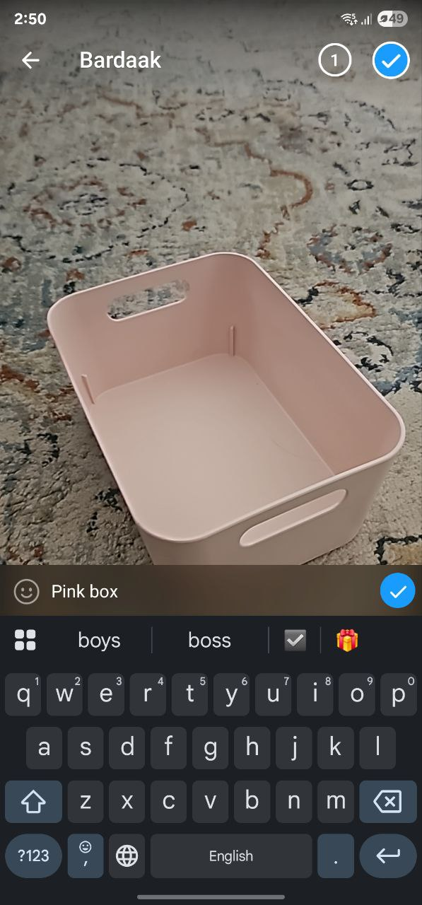
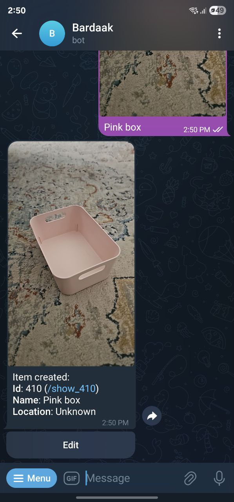
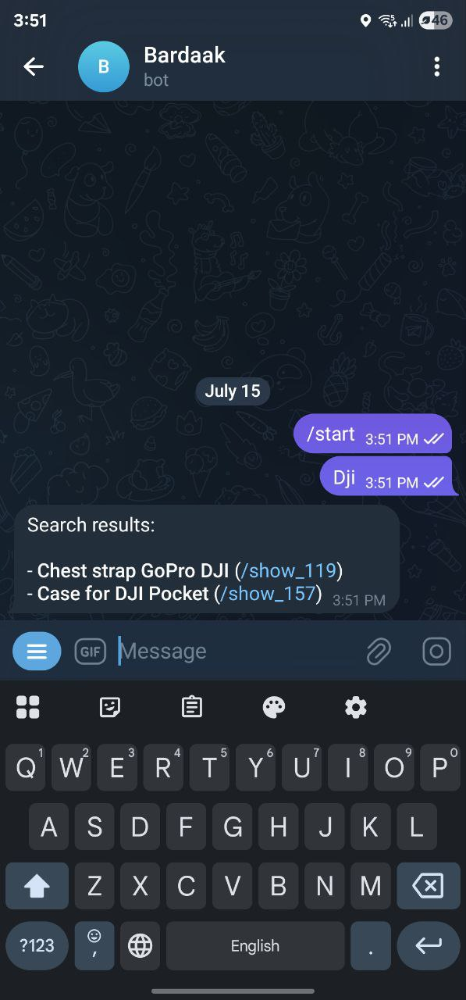
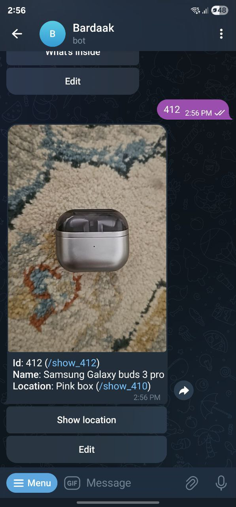
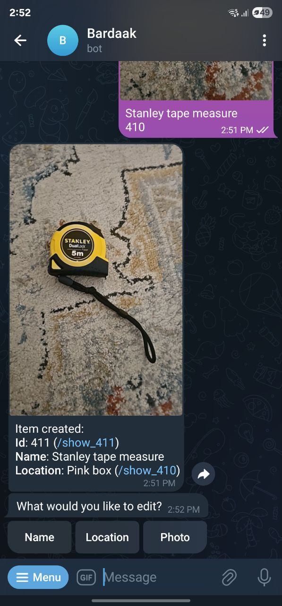
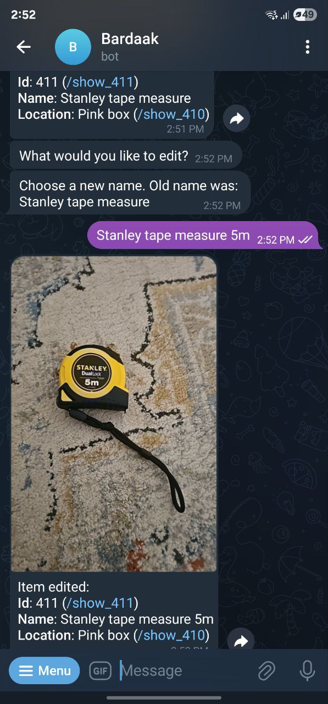
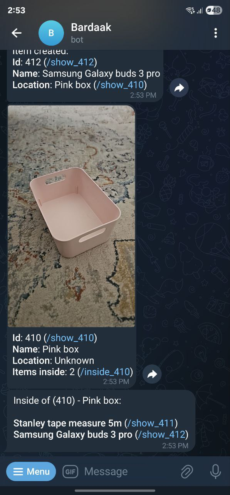
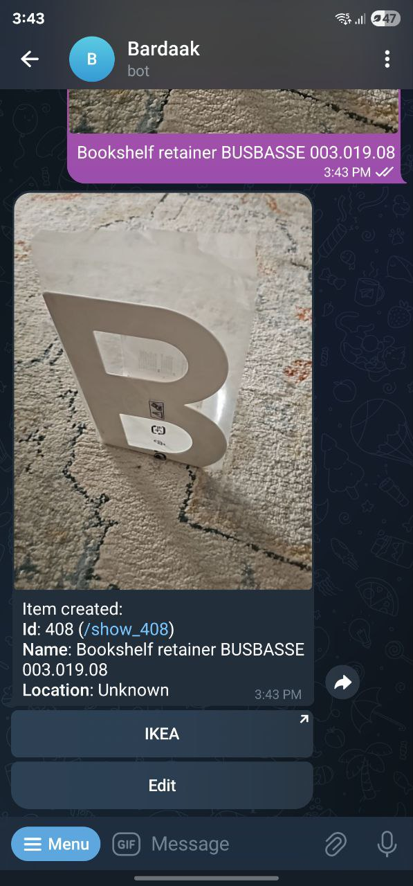

# Bardaak - Simple home inventory system

## Why 

There are many inventory systems for huge companies, but none simple enough to be usable
to remind me where I put what during spontaneous house cleaning

## What 

This is a self-hosted Telegram Bot with Algolia as search engine, SQLite as DB and local FS as storage for images

## How does it work

### Creating items 

Just send your bot a picture with text consisting of one two lines: 
1. Name of item 
2. Optional: Integer ID of box where you put it (boxes and shelves are items too)

 

## Finding items 

There are several ways:

### Via search
Just send bot some text and it will try to find it
From there you will be able to get individual items by clicking `/show_{id}` links

### By entering its ID 
Just send bot some integer - it will fetch corresponding item  

### Editing items

When you get an item - there is "Edit" button. Press it to change Name, Location or Photo

### Items and Locations 

Each item can refer to one location, which is also an item. E.g. "cat (id: 2) is in a box (id: 1)"  (or not?)

Here if we fetch info for "box" - we'll be able to query all items inside that box

### For Ikea fans

In our home we have a lot of Ikea stuff, some of it unpacked and forgotten for years.

If there is Ikea article number in name of item - there will be a button to directly go to that item in Ikea.

This behavior is customizable via `STORE_BUTTON_TITLE`, `STORE_BUTTON_URL`, `STORE_ARTICLE_REGEX` 

### All items without parents

There is `/allparents` command you can use to list every item that doesn't have parents

## Installation

### Prerequisites

- Algolia
    1. Create free account on https://algolia.com
    2. Create application and index in it called `items`
    3. Write down Application ID, Search key, Write key
- Telegram
    1. If not registered - do it (https://telegram.org)
    2. Create new bot by messaging `@BotFather`
    3. Write down your bot's token
- Telegram user ids of users allowed to interact with bot 
    1. You can use `@userinfobot` to get ids of you and other users of your home

### Docker-compose (Easiest way)

Prerequsites: you need `docker` and `docker-compose` installed for this method.

1. Copy `docker-compose.yml.stub` to `docker-compose.yml` and edit it: 
    - Replace `/path/to/volume` with directory (recommended) or docker-volume where both database and images will be stored
    - Replace placeholders with corresponding values in all other lines with `# Change value here` comment
2. Start your bot to see if it works and check logs: run `docker-compose up` from the directory with `docker-compose.yml`
3. Stop the bot with `Ctrl-C` and `docker-compose down` and start it in detached fashion: `docker-compose up -d`.
    - When it's running in detached state you can now close terminal

### Other ways 

Feel free to build this app using Gradle and deploy it however you want

